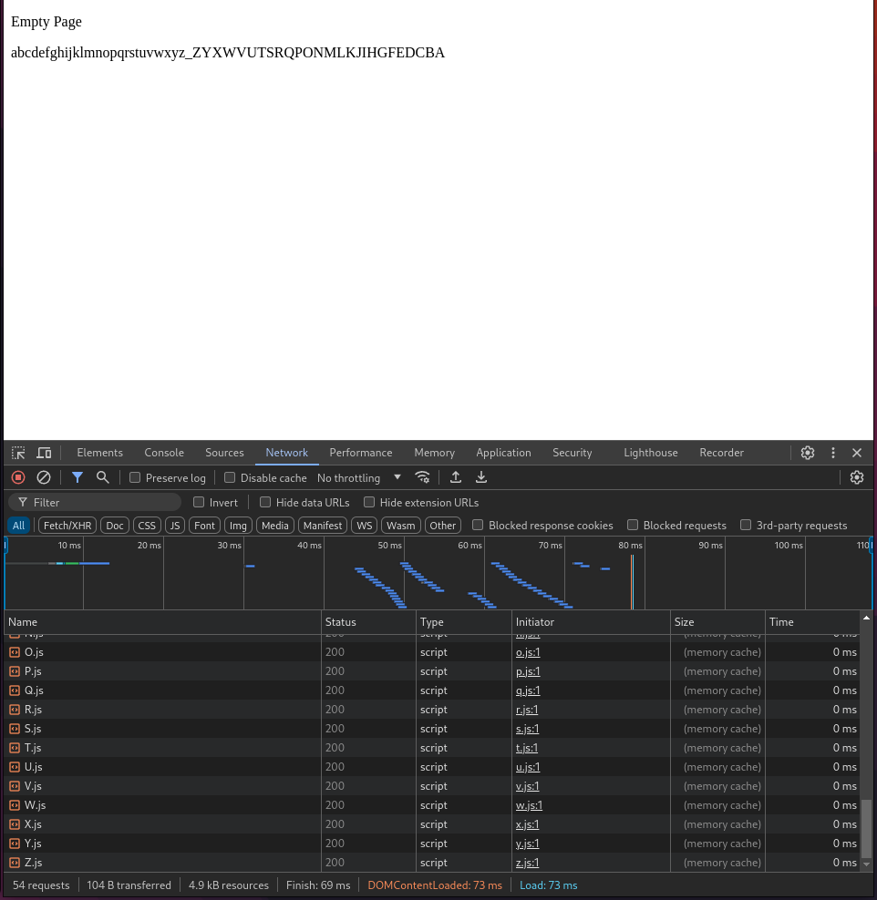

# firefox-cache-bug

Run:

```bash
$ python -m http.server
# or
$ miniserve . --verbose
```

The `gen.py` script is to generate the files.

## tldr; firefox cache performance is worse

A side-by-side comparison video:

https://github.com/user-attachments/assets/bf63f45d-bd52-4829-a79f-0daa1ed3baba

(Note that the first few times, we're actually requesting the server, but after that it's only doing a single request to `/`, so this is a caching issue, not something to do with the webservers).

## the bug

Here is Firefox loading from cache. Note how the requests all take '0ms' and are 'cached' but for some reason they're all fetched sequentially and overall take 600ms to load, with a gap of a couple hundred milliseconds between the first round (lowercase, directly included) and second round (uppercase, transitively included).


The fully uncached load (from the network on localhost), takes roughly a second or so:


In contrast, google chrome takes 70ms to load from cache, and it appears practically instant.



Even chrome's uncached from network load is significantly faster than firefox's 600ms cached load, at just 300ms. Though this isn't as stark for actual (i.e. non-localhost) websites.


## notes

- Images are from firefox v128.
- Reproduced in the latest nightly (131.01a1, as of 16 Aug).
- Chromium is version `126.0.6478.126 (Official Build) Fedora Project (64-bit) `

Firefox's network performance analyser appears very not happy, showing that it took 0 seconds for all the responses (when it clearly does not):


The actual performance debugger (when it doesn't crash, which it really likes to do and bring down firefox with it), reports that most of the time is spent in `poll()`.
A profile can be seen at [https://share.firefox.dev/3X8H4TJ](https://share.firefox.dev/3X8H4TJ).
... Weirdly enough the times reported here of ~200ms for a 'HTTP Response' (from cache?) seem more accurate than the network tools themselves, though are missing any actual TCP connection information unlike the first 304 Not Modified.

I /suspect/ (without ever having looked at Firefox sources) that this is sort of highly-contested-mutex style concurrency issue (as this would explain the polling as waiting for threads to wakeup), though I don't know how Firefox cache works to know if this is correct.
